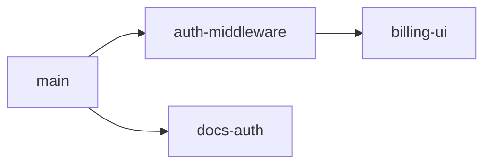

# Split to PRs

Turn one pile of work into a few small PRs.

## 到達点

分割計画を読んだレビュアー／実装者が、**どの PR に何が含まれ、どの順でマージするか**を迷わず実行できること。  
「関連する変更をいくつかに分けます」で止まったら失敗。

## Hard rules

- Do not create branches, commit, push, or open PRs until the user approves the split plan.
- Never discard user work. No destructive git commands (`reset --hard`, `clean -fdx`, branch deletion, force-push, history rewrite) without explicit approval.
- Always save a recoverable snapshot before moving work around. This often starts from dirty work on `main`, so do not assume there is already a safe branch.
- Stage only named files or hunks. No `git add .` / `git add -A`.

## 1. Check the state

Compare the current work to the repo's default branch, including committed and uncommitted changes. Summarize the real slices you see, and use the chat history to recover intent.

Before proposing slices, find ownership signals for the touched paths (`CODEOWNERS`, nested ownership files, `tools/ownership/PRODUCTOWNERS`, or repo equivalents) and use them to identify natural reviewer boundaries.

## 2. Propose the split

### 具体性の下限（悪い例 / 良い例）

悪い例（不十分）:
> フロントとバックエンドで PR を分けましょう。

良い例（このレベルまで求める）:
> 1. `fix/auth-middleware` — `src/auth/*` のみ。CODEOWNERS `@platform`. base: `main`. 独立可  
> 2. `fix/billing-ui` — `apps/web/billing/*`. `@frontend`. **stacks on #1**（auth hook 依存）  
> 3. `fix/docs-auth` — `docs/auth.md` のみ。独立。#1 マージ後でも可  
> 含めない: `package-lock.json` の無関係な差分は #1 に閉じ込めず捨てない（別 slice か元ブランチに残す）

### 図必須（2 slice 以上）

複数 slice があるときは **Mermaid（または同等 ASCII）必須**。文章の箇条書きだけでは不可。依存（stack）を矢印で示す。



Use judgment on detail. Usually PR titles are enough. Add a one-line scope note only when a title is unclear.

Optimize for reviewer-aligned PRs with minimal unrelated diff: split independent owners or concerns, keep tightly coupled changes together, and when stacking is necessary, order foundations before consumers.

Default to independent PRs off the default branch. Stack PRs only when the dependency is real.

Ask for approval before starting.

## 3. Execute the split

- If there is uncommitted work, save a recoverable snapshot without changing the working tree:

  ```bash
  SHA=$(git stash create "pre-split")
  if [ -n "$SHA" ]; then
    git update-ref "refs/backup/pre-split-$(date +%s)" "$SHA"
  fi
  ```

- For each approved slice, create a branch from the right base, stage and commit only the planned files or hunks, then push and open the PR.

## 4. Report back

Keep it short: PR titles and URLs, plus anything left on the starting branch or working tree. Do not delete the backup ref or original branch unless the user asks.
